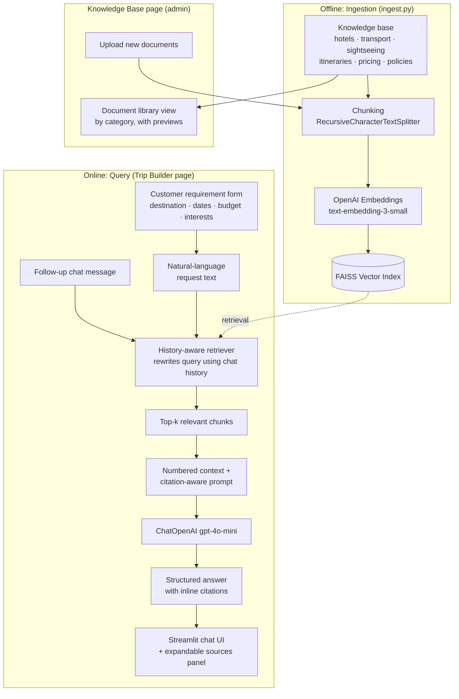

# 🧳 Wanderly Travels — AI Travel Package Recommendation Assistant

A **Retrieval-Augmented Generation (RAG)** application that helps travel agents turn a
customer's requirements into a fully-costed, citation-grounded travel package in
seconds — instead of manually searching hotel brochures, transport rate sheets, and
past itineraries.

> Built as an end-to-end, production-shaped RAG system: document ingestion → chunking →
> embeddings → FAISS vector search → conversational, history-aware retrieval →
> citation-grounded generation → a Streamlit UI on top.

---

## 1. The problem

A travel agent gets a request like:

> *Destination: Goa · Travel date: 15 December · Travellers: 4 · Duration: 4 days ·
> Budget: ₹50,000*

To answer it well, the agent normally has to cross-reference hotel rate sheets,
transport pricing, sightseeing brochures, past itineraries for similar trips, and the
cancellation policy — scattered across multiple documents. **Wanderly Travels**
automates that lookup: the agent fills in the customer's requirements, and the
assistant retrieves the relevant knowledge and drafts a complete package.

## 2. What it does

Given structured customer requirements (destination, dates, number of travellers,
budget, hotel category, transport preference, interests), the assistant returns:

- ✅ Recommended hotel(s), matched to budget and preferred category
- ✅ A day-wise itinerary
- ✅ Sightseeing & activity suggestions matched to the customer's interests
- ✅ Transport recommendations (to the destination + local transfers)
- ✅ An estimated total cost, checked against the stated budget
- ✅ Important travel instructions (ID requirements, seasonal notes, etc.)
- ✅ The applicable cancellation & refund policy

Every factual claim in the answer carries an inline citation tag (`[1]`, `[2]`, ...)
that maps to the exact source document in an expandable "Sources" panel — so the agent
can verify anything before quoting it to a customer. The agent can then keep chatting
("make it cheaper", "swap the hotel for something 5-star") and the assistant
re-retrieves and regenerates with full conversational context.

A second screen, **Knowledge Base**, is where that data actually lives: a content
library of the documents behind every recommendation, organized by category (Hotels,
Transport, Pricing, Policies, ...) with destination (Goa, Manali, Kerala, or General)
as a second, filterable tag on every document, a preview of each one, and a place to
upload new documents — so "how do I add a new destination's data" has a real answer
inside the app, not just a CLI command. It's deliberately framed as a document
library, not a RAG pipeline dashboard — no chunking, embeddings, or vector-store
detail in sight, because that's implementation detail the person managing this
content shouldn't need to think about.

Each category is also **one document per destination**, not one document covering
all three — a Goa query retrieves only Goa documents, never chunks from the Manali or
Kerala files. Hotels go a level further still: **one document per property** (14
files — `goa_sea_breeze_inn.md`, `goa_grand_riviera.md`, ...) rather than one
"Goa Hotels" file listing all five properties. Besides organizing the library more
sensibly, this measurably improves retrieval precision — verified live: asking about
Sea Breeze Inn's amenities retrieves `goa_sea_breeze_inn.md` as the top, and only,
source used in the answer, with no other property's details bleeding in.

## 3. Architecture



The Knowledge Base page only surfaces node `A`/`N` and `P` — organizing and previewing
documents. The chunking/embedding/index machinery (`B`–`D`) is invisible to that screen
on purpose; it's covered in this README instead, for whoever's reviewing the code.

### Why these design choices

| Decision | Reasoning |
|---|---|
| **FAISS (local)** | Zero external infra to run a convincing demo; swappable for Pinecone/Qdrant/pgvector in production with no application-code changes since access goes through `src/vectorstore.py`. |
| **History-aware retriever** | A follow-up like *"make it cheaper"* has no meaning on its own — it must be rewritten against the chat history *before* retrieval, not just at generation time. |
| **Numbered-citation prompting** | Forces the model to ground every price/policy claim in a specific source, which is verifiable in the UI — critical when the output is quoted directly to a paying customer. |
| **Structured intake form → NL query** | Keeps retrieval and generation logic reusable for both the initial structured request *and* free-text follow-up chat, instead of maintaining two separate pipelines. |
| **LCEL (`RunnablePassthrough.assign`) over the `create_stuff_documents_chain` helper** | Needed the raw retrieved `Document` objects *and* the formatted citation string in the same output — the helper only exposes the latter. |
| **SQLite via SQLAlchemy, not a JSON sidecar or hardcoded dict** | Categories and destinations used to be a fixed Python dict — adding one meant editing code. A real table (with a foreign key from `documents`) makes "add a category" a write, not a deploy; SQLite specifically because a single-writer admin tool doesn't need a server process, matching the FAISS-is-local pragmatism above. |

## 4. Tech stack

- **Orchestration:** LangChain (LCEL — `RunnableWithMessageHistory`, `RunnableBranch`, `RunnablePassthrough.assign`)
- **LLM:** OpenAI `gpt-4o-mini` (configurable)
- **Embeddings:** OpenAI `text-embedding-3-small` (configurable)
- **Vector store:** FAISS (local, persisted to disk)
- **Database:** SQLite via SQLAlchemy 2.0 ORM (category/destination/document metadata)
- **UI:** Streamlit
- **Testing:** Pytest, GitHub Actions CI
- **Language:** Python 3.11

## 5. Project structure

```
travel-rag-assistant/
├── app.py                     # Entry point: page config, shared CSS, navigation
├── pages/
│   ├── trip_builder.py        # Main screen: intake form + follow-up chat
│   └── knowledge_base.py      # Admin screen: document library by category, preview, upload
├── ingest.py                  # CLI: build the FAISS index (same logic the app uses automatically)
├── config.py                  # Settings (env-var driven)
├── src/
│   ├── ingestion.py           # Load + chunk documents (PDF/TXT/MD)
│   ├── vectorstore.py         # Build/save/load FAISS index
│   ├── rag_chain.py           # History-aware, citation-grounded RAG chain
│   ├── request_builder.py     # Structured form -> natural-language query
│   ├── app_core.py            # Streamlit caching + shared state used by both pages
│   ├── db.py                  # SQLAlchemy models + session (categories/locations/documents)
│   └── kb_admin.py            # Knowledge-base business logic over src/db.py (testable, no Streamlit import)
├── data/knowledge_base/       # Travel agency knowledge base (sample data), 28 files
│   ├── {goa,manali,kerala}_guide.md          # 1 destination guide per location (3)
│   ├── {goa,manali,kerala}_<hotel_name>.md   # 1 file per hotel property (14 total: 5+4+5)
│   ├── {goa,manali,kerala}_transport.md      # 1 transport sheet per location (3)
│   ├── {goa,manali,kerala}_sightseeing.md    # 1 activities list per location (3)
│   ├── {goa,manali,kerala}_itinerary.md      # 1 sample itinerary per location (3)
│   ├── pricing_and_addons.md                 # Applies across all destinations
│   └── travel_policies.md                    # Applies across all destinations
├── tests/                     # Pytest unit tests (no API calls required)
├── .streamlit/config.toml     # Theme + hides Streamlit's dev chrome
├── .github/workflows/tests.yml
├── Dockerfile
├── requirements.txt
├── .env.example
├── faiss_index/                # generated — vector index, gitignored
└── wanderly.db                 # generated — SQLite database, gitignored
```

## 6. Setup

### Prerequisites
- Python 3.11+
- An OpenAI API key ([platform.openai.com](https://platform.openai.com))

### Install

```bash
git clone <this-repo-url>
cd travel-rag-assistant
python -m venv .venv
.venv\Scripts\activate        # Windows
# source .venv/bin/activate   # macOS/Linux
pip install -r requirements.txt
```

### Configure

```bash
cp .env.example .env
# then edit .env and set OPENAI_API_KEY=sk-...
```

### Run the app

```bash
streamlit run app.py
```

The knowledge base index is built automatically on first launch (and reused on
every run after that — no manual step needed). Just fill in the trip request
form. Try the example from section 1: Goa, 15 December, 4 travellers, 4 days,
₹50,000 budget, interests = Beaches + Sightseeing.

Prefer the CLI? `python ingest.py --data-dir data/knowledge_base` builds the
same index outside the app (useful for CI or pre-warming a deployment).

The app has two screens, switchable from the sidebar nav:
- **🧳 Trip Builder** — the day-to-day tool: the intake form and follow-up chat.
- **📚 Knowledge Base** — a content library of the documents behind every recommendation, grouped by category (Hotels, Transport Options, Pricing & Add-ons, Policies & Cancellations, ...) with destination as a second, filterable tag, each document with a rendered preview. Categories and destinations aren't a fixed list baked into the app — they're rows in a real SQLite database (`src/db.py`), seeded once with sensible defaults and extensible from the upload form itself: pick "+ Add new category" or "+ Add new destination", type a name, and it exists from then on, immediately available for the next upload too.

Both screens are written in plain business language — no mention of chunking,
embeddings, or vector search anywhere in the UI. That's covered in this README instead.

The sidebar's **Recent** list keeps every past conversation from the current browser
session, auto-titled from its first message (e.g. "Goa trip package") — click one to
resume it, with full chat history and follow-up context intact, without losing your
current conversation. This is in-memory per session (not persisted across an app
restart or a new browser tab), which is the right tradeoff for a demo; a production
deployment would back this with a real datastore keyed by user account.

## 7. Example

**Input (via the form):**
Destination: `Goa` · Start date: `15 December 2026` · Duration: `4 days` ·
Travellers: `2 adults, 2 children` · Budget: `₹50,000` · Hotel category: `Budget` ·
Interests: `Beaches, Sightseeing`

**Output (abridged — actual output from a live run against the OpenAI API, after the
per-destination document split described in section 3):**
```
## Day-wise Itinerary
1. Arrival, check-in at Sea Breeze Inn, relax at Colva Beach, evening at leisure.
2. North Goa Beaches & Forts Tour, water sports for adults, dinner at a beach shack.
3. South Goa Heritage Tour, free time for shopping, farewell dinner.
4. Check-out and departure transfer.

## Sightseeing & Activities
- North Goa Beaches & Forts Tour — half-day, ₹700/person [4]
- South Goa Heritage Tour — half-day, ₹600/person [4]
- Water Sports Combo — 2 hours, ₹1,500/person [4]

## Transport Recommendations
- Round-trip train (Mumbai–Madgaon–Mumbai), 4 passengers ≈ ₹6,400 [5]
- Airport/station transfers ≈ ₹1,600 [5]

## Estimated Total Cost
Hotel ₹10,800 + Transport ₹13,000 + Sightseeing ₹8,200 + Meals ₹2,400 + Misc ₹3,000
= ~₹47,400 for a family of 4 — within the ₹50,000 budget
```
Sources panel: `[1]–[3] goa_itinerary.md`, `[4] goa_sightseeing.md`,
`[5] goa_transport.md`, `[6]–[7] goa_hotels.md`, `[8] goa_guide.md` — every retrieved
source is Goa-specific; none of the Manali or Kerala documents were pulled in, since
each destination's content lives in its own file.

A follow-up of *"Can you make it cheaper?"* re-retrieved with the conversation in
context and produced a revised ~₹34,400 plan by dropping the paid water-sports
activity. A follow-up of *"What's the cancellation policy?"* correctly retrieved
and cited `travel_policies.md` even though that source wasn't used in the
original answer — demonstrating the history-aware retrieval step.

## 8. Testing

```bash
pytest -v
```

Tests cover chunking behavior, citation formatting/numbering, and the
form-to-query builder — all pure logic, so they run without an API key (and in CI,
see `.github/workflows/tests.yml`).

## 9. Docker

```bash
docker build -t travel-rag-assistant .
docker run -p 8501:8501 --env-file .env travel-rag-assistant
```

## 10. Design notes & how the RAG pipeline works

1. **Ingestion** (`src/ingestion.py`): loads `.pdf`/`.txt`/`.md` files, splits them
   with `RecursiveCharacterTextSplitter` (1000-char chunks, 150-char overlap by
   default) so chunks stay small enough for precise retrieval but large enough to
   keep context coherent. Every chunk keeps its source filename (and PDF page, when
   applicable) in metadata.
2. **Embedding + indexing** (`src/vectorstore.py`): chunks are embedded with OpenAI's
   `text-embedding-3-small` and stored in a FAISS index, persisted to disk so it
   doesn't need to be rebuilt on every run.
3. **History-aware retrieval** (`src/rag_chain.py`): the raw user turn (or the
   auto-generated request from the intake form) is rewritten into a standalone query
   using the chat history before hitting the vector store — so "swap the hotel for
   something nicer" resolves correctly on turn 3 of a conversation.
4. **Citation-grounded generation**: retrieved chunks are numbered and injected into
   the system prompt; the model is instructed to tag every factual claim with its
   source number and to say plainly when the knowledge base doesn't cover something,
   rather than inventing a price or policy.
5. **Conversational memory**: `RunnableWithMessageHistory` keeps a per-session
   message history, so the whole form → chat interaction is one continuous,
   context-aware conversation.

## 11. Limitations & possible extensions

This is intentionally a **solid core RAG system**, not a fully productionized
platform. Natural next steps, in rough order of impact:

- **Hybrid search + re-ranking** (BM25 + dense retrieval, or a cross-encoder
  re-ranker) for sharper retrieval on numeric/price queries.
- **Automated RAG evaluation** (e.g. RAGAS: faithfulness, answer relevancy,
  context precision) instead of manual spot-checking.
- **Real inventory integration**: today the "knowledge base" is static sample data;
  in production this would sync live hotel/transport availability and pricing.
- **Auth + multi-tenant storage** so each travel agency's documents and
  conversations are isolated.
- **Streaming responses** in the UI for lower perceived latency.
- **A managed vector store** (Pinecone/Qdrant/pgvector) for horizontal scale and
  metadata filtering (e.g. filter by destination before the similarity search).

## License

MIT — see [LICENSE](LICENSE).
